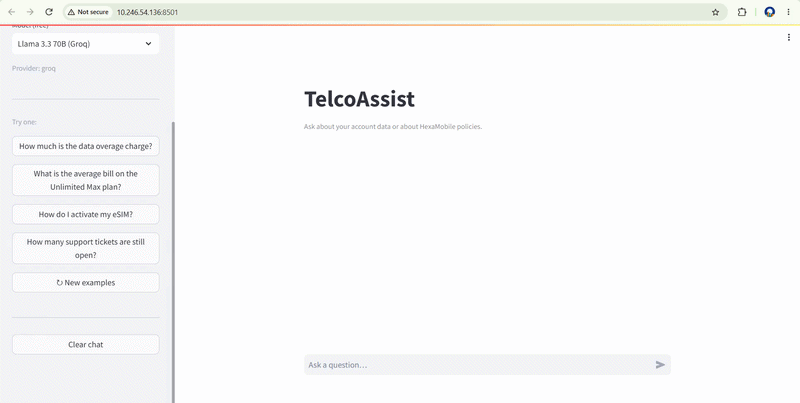
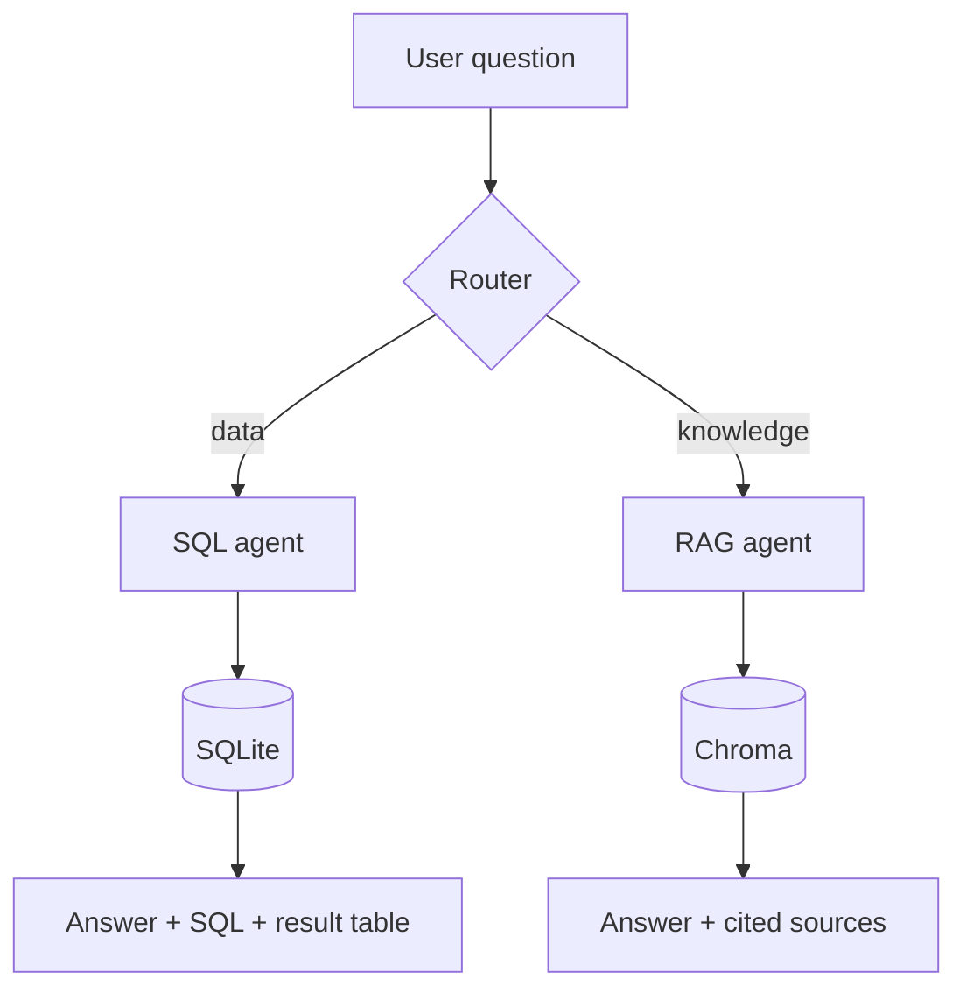
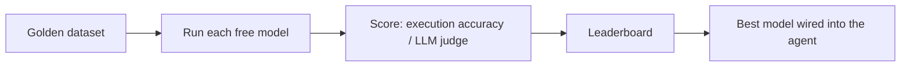

# TelcoAssist

A support assistant for a fictional mobile operator, HexaMobile. It answers two kinds of
questions and picks the right engine for each:

- Data questions ("How many customers churned in Ile-de-France?") with text-to-SQL over a
  SQLite database.
- Policy questions ("What does roaming cost outside the EU?") with retrieval-augmented
  generation over the support documents.

Before the bot ships, an evaluation harness benchmarks several free LLMs on both tasks and
selects the best one. Everything runs on free models and tools.

## Demo



## Problem

A mobile operator's support line gets two very different questions. Some need a figure from
the database (churn, revenue, plan counts). Others need an answer from policy documents
(cancellation, roaming, billing rules). One assistant has to tell them apart, pull from the
right source, and run on a model that was measured rather than guessed at.

## How it works



- Router: scores the question against database terms and policy terms. A confident score
  decides right away; a tie falls back to a one-word LLM classification.
- SQL agent: sends the schema plus the allowed values of the categorical columns, generates
  SQL, runs it, and phrases the returned row. The figure comes from the database; the model
  only writes the query and the sentence.
- RAG agent: retrieves the top document chunks and answers only from them. If the answer is
  not in the retrieved text, it says so instead of guessing.

## How the model is chosen

The selection is by measurement. Two golden datasets score the candidate models, and the
harness writes a leaderboard.



Text-to-SQL, execution accuracy (compare result sets, not query text), 24 questions:

| Model (free) | Overall | Easy | Medium | Hard |
|---|---|---|---|---|
| Llama 3.3 70B (Groq) | 100% | 100% | 100% | 100% |
| Llama 3.1 8B (Groq) | 87.5% | 100% | 88% | 75% |
| GPT-OSS 20B (Groq) | 87.5% | 100% | 100% | 62% |

RAG, with retrieval and generation scored separately, 12 questions (one out of scope):

- Retrieval: hit-rate@3 = 100% (11/11), MRR = 0.955.
- Generation, graded by an LLM judge:

| Model (free) | Score | Refused the out-of-scope question |
|---|---|---|
| Llama 3.3 70B (Groq) | 11/12 (91.7%) | yes |
| Llama 3.1 8B (Groq) | 11/12 (91.7%) | yes |
| GPT-OSS 20B (Groq) | 10/12 (83.3%) | yes |

Router: 16/16 on a labeled set.

Selected model: Llama 3.3 70B (Groq), for both engines. It scored 24/24 on SQL, a clear lead.
On RAG generation it ties with Llama 3.1 8B at 11/12; since it also wins SQL outright and
retrieval is model-independent, the 70B is the single safe choice. The two smaller SQL models
tie at 87.5% overall but split on the hard questions (75% vs 62%), which is where the dataset's
traps are meant to separate them.

## Handling real LLM problems

The project runs into the issues you actually meet with LLMs. Each is handled explicitly.

- Models get retired. Groq decommissioned `gemma2-9b-it` during the project (HTTP 400). The
  runner now fails fast on 400/404 and skips that model instead of retrying and crashing, so
  one dead model never stops a run.
- Free availability shifts. The three OpenRouter free models returned 404 ("unavailable for
  free") at run time. They were skipped automatically and the run finished on the models that
  were up.
- Schema alone is not enough for text-to-SQL. A model cannot know that a region is spelled
  `Ile-de-France`. The prompt includes the distinct values of the low-cardinality columns,
  which removes a whole class of wrong-value answers.
- Analytics answers must not be invented. The SQL agent takes the number from the database and
  only asks the model to word it. The model never reports a figure it was not handed.
- RAG has to refuse when it does not know. One golden question is out of scope, so the correct
  answer is a refusal. All selected models pass it.
- An LLM judge is not neutral. Every model missed the same RAG question (Q3, cancellation),
  and it stayed wrong after the answer style was changed. Reading the actual answer shows it is
  correct and grounded; the judge marks it down only for not matching the reference's exact
  wording. The judge is treated as a variable to check, not a given.
- Results have to be reproducible. Data generation is seeded, gold answers are frozen to CSV
  once, and offline mock runs check the whole pipeline before any API call is spent.

## Tech stack

| Area | Tool |
|---|---|
| Synthetic data | Faker, pandas |
| Database | SQLite |
| LLM inference | Groq and OpenRouter, via the OpenAI-compatible API |
| Embeddings | fastembed (`bge-small-en-v1.5`, ONNX, no PyTorch) |
| Vector store | Chroma |
| UI | Streamlit |

Embeddings run locally; inference uses free API tiers. No paid services.

## Project structure

```
telco-assist/
  data/
    generate_data.py     synthetic customers, plans, usage, bills, tickets
    docs/                support documents (the RAG corpus)
  db.py                  load the CSVs into SQLite
  schema_extractor.py    dump the schema for the prompt
  context.py             schema + categorical value hints
  models.py              free-model registry and one OpenAI-compatible call
  sql_golden.py          24 golden questions and reference SQL
  sql_make_golden.py     freeze gold results to CSV
  sql_evaluator.py       execution-accuracy comparison
  sql_eval.py            SQL leaderboard
  rag_common.py          embeddings and Chroma access
  rag_ingest.py          chunk, embed, and index the documents
  rag_answer.py          retrieve and answer with citations
  rag_golden.py          golden QA set with one out-of-scope case
  rag_eval.py            retrieval and generation leaderboards
  router.py              data vs knowledge routing
  sql_agent.py           question to SQL to answer
  rag_agent.py           question to grounded answer
  assistant.py           ask(): route and dispatch
  app.py                 Streamlit UI
  make_report.py         eval CSVs to Markdown tables
```

## Run it

Requires Python 3.10+ and at least one free API key: Groq (console.groq.com/keys) or
OpenRouter (openrouter.ai/keys).

Install:

```bash
pip install -r requirements.txt
```

Build the database and the document index:

```bash
python data/generate_data.py
python db.py
python schema_extractor.py
python sql_make_golden.py
python rag_ingest.py
```

Add your key(s):

```bash
cp .env.example .env
```

Put the keys in `.env` (not `.env.example`, which is committed):

```
GROQ_API_KEY=...
OPENROUTER_API_KEY=...
```

Run the evaluations and build the results tables:

```bash
python sql_eval.py
python rag_eval.py
python make_report.py --write
```

Start the app at http://localhost:8501:

```bash
streamlit run app.py
```

Without a key the app still runs and shows the routing decision and retrieved documents. The
evals have a `--mock` mode that checks the pipeline offline. Generated files (`telco.db`, the
Chroma index, result CSVs) are git-ignored and rebuilt by the commands above.

## Free vs paid

The system runs at no cost. Each free choice has a paid upgrade whose effect shows up as a
number on the same leaderboards.

| Component | Free (used here) | Paid upgrade | Metric it moves |
|---|---|---|---|
| SQL / RAG model | Groq and OpenRouter free models | GPT-4o, Claude, Mistral Large | hard-tier SQL accuracy, fewer RAG errors |
| Embeddings | fastembed `bge-small` | OpenAI, Voyage, Cohere | retrieval hit-rate on larger corpora |
| Reranking | none | Cohere Rerank | citation precision |
| Judge | free model | frontier model | less grading noise |
| Vector store | Chroma (local) | Qdrant / Pinecone cloud | scale and latency |

## Limitations

- The data is synthetic, which keeps it free and private but is cleaner than production data.
- The document corpus is small, so retrieval is easy here; a reranker matters at hundreds of
  documents.
- The judge is one of the candidate models, so a held-out or stronger judge would be more
  rigorous. The shared miss on the cancellation question is judge strictness: on inspection
  that answer is correct and grounded.
- Not wired yet: an Ollama offline backend (the model layer is ready for it), answer streaming
  in the UI, and a hosted demo.
